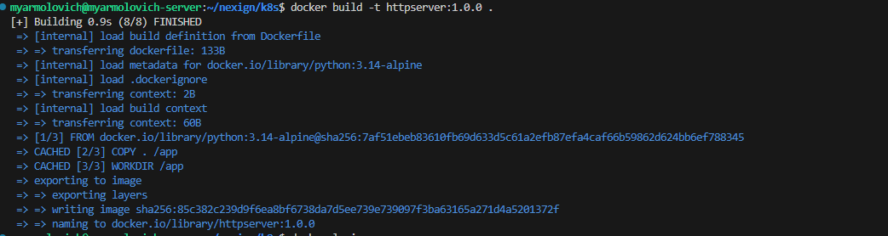
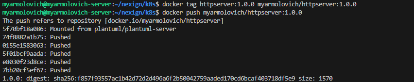
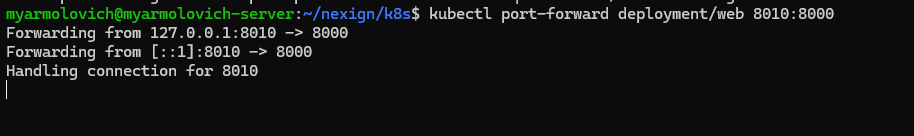
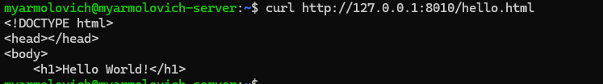

## сборка контейнера
```
FROM python:3.14-alpine

COPY . /app
WORKDIR /app

RUN addgroup -g 10001 server \
    && adduser -u 10001 -G server -s /bin/sh -D server
USER 10001

CMD ["python3", "-m", "http.server", "8000"]
```



## Установка кубернетеса
```
go install sigs.k8s.io/kind@v0.31.0 && kind create cluster
Creating cluster "kind" ...
 ✓ Ensuring node image (kindest/node:v1.35.0) 🖼
 ✓ Preparing nodes 📦
 ✓ Writing configuration 📜
 ✓ Starting control-plane 🕹️
 ✓ Installing CNI 🔌
 ✓ Installing StorageClass 💾
Set kubectl context to "kind-kind"
You can now use your cluster with:

kubectl cluster-info --context kind-kind

Have a nice day! 👋
```

## Деплоймент
```
apiVersion: apps/v1
kind: Deployment
metadata:
  name: web
  labels:
    app: web
spec:
  replicas: 2
  selector:
    matchLabels:
      app: web
  template:
    metadata:
      labels:
        app: web
    spec:
      containers:
      - name: web
        image: myarmolovich/httpserver:1.0.0
        ports:
        - containerPort: 8000
        livenessProbe:
          httpGet:
            path: /hello.html
            port: 8000
          initialDelaySeconds: 10
          periodSeconds: 10
          timeoutSeconds: 2
          failureThreshold: 3

```



```
myarmolovich@myarmolovich-server:~$ kubectl describe deployment web
Name:                   web
Namespace:              default
CreationTimestamp:      Wed, 24 Dec 2025 16:09:32 +0300
Labels:                 app=web
Annotations:            deployment.kubernetes.io/revision: 1
Selector:               app=web
Replicas:               2 desired | 2 updated | 2 total | 2 available | 0 unavailable
StrategyType:           RollingUpdate
MinReadySeconds:        0
RollingUpdateStrategy:  25% max unavailable, 25% max surge
Pod Template:
  Labels:  app=web
  Containers:
   web:
    Image:         myarmolovich/httpserver:1.0.0
    Port:          8000/TCP
    Host Port:     0/TCP
    Liveness:      http-get http://:8000/hello.html delay=10s timeout=2s period=10s #success=1 #failure=3
    Environment:   <none>
    Mounts:        <none>
  Volumes:         <none>
  Node-Selectors:  <none>
  Tolerations:     <none>
Conditions:
  Type           Status  Reason
  ----           ------  ------
  Available      True    MinimumReplicasAvailable
  Progressing    True    NewReplicaSetAvailable
OldReplicaSets:  <none>
NewReplicaSet:   web-7579d7dfc8 (2/2 replicas created)
Events:
  Type    Reason             Age   From                   Message
  ----    ------             ----  ----                   -------
  Normal  ScalingReplicaSet  8m3s  deployment-controller  Scaled up replica set web-7579d7dfc8 from 0 to 2
```

```
Name:             web-7579d7dfc8-bxqn8
Namespace:        default
Priority:         0
Service Account:  default
Node:             kind-control-plane/172.23.0.2
Start Time:       Wed, 24 Dec 2025 16:09:32 +0300
Labels:           app=web
                  pod-template-hash=7579d7dfc8
Annotations:      <none>
Status:           Running
IP:               10.244.0.7
IPs:
  IP:           10.244.0.7
Controlled By:  ReplicaSet/web-7579d7dfc8
Containers:
  web:
    Container ID:   containerd://78b51c6426cd89296c4d559f5ae91d95675d939514fecc896307aea575b0d9b3
    Image:          myarmolovich/httpserver:1.0.0
    Image ID:       docker.io/myarmolovich/httpserver@sha256:f857f93557ac1b42d72d2d496a6f2b50042759aaded170cd6bcaf403718df5e9
    Port:           8000/TCP
    Host Port:      0/TCP
    State:          Running
      Started:      Wed, 24 Dec 2025 16:09:32 +0300
    Ready:          True
    Restart Count:  0
    Liveness:       http-get http://:8000/hello.html delay=10s timeout=2s period=10s #success=1 #failure=3
    Environment:    <none>
    Mounts:
      /var/run/secrets/kubernetes.io/serviceaccount from kube-api-access-l5c79 (ro)
Conditions:
  Type                        Status
  PodReadyToStartContainers   True
  Initialized                 True
  Ready                       True
  ContainersReady             True
  PodScheduled                True
Volumes:
  kube-api-access-l5c79:
    Type:                    Projected (a volume that contains injected data from multiple sources)
    TokenExpirationSeconds:  3607
    ConfigMapName:           kube-root-ca.crt
    Optional:                false
    DownwardAPI:             true
QoS Class:                   BestEffort
Node-Selectors:              <none>
Tolerations:                 node.kubernetes.io/not-ready:NoExecute op=Exists for 300s
                             node.kubernetes.io/unreachable:NoExecute op=Exists for 300s
Events:
  Type    Reason     Age    From               Message
  ----    ------     ----   ----               -------
  Normal  Scheduled  9m28s  default-scheduler  Successfully assigned default/web-7579d7dfc8-bxqn8 to kind-control-plane
  Normal  Pulled     9m28s  kubelet            Container image "myarmolovich/httpserver:1.0.0" already present on machine and can be accessed by the pod
  Normal  Created    9m28s  kubelet            Container created
  Normal  Started    9m27s  kubelet            Container started


Name:             web-7579d7dfc8-m2tqm
Namespace:        default
Priority:         0
Service Account:  default
Node:             kind-control-plane/172.23.0.2
Start Time:       Wed, 24 Dec 2025 16:09:32 +0300
Labels:           app=web
                  pod-template-hash=7579d7dfc8
Annotations:      <none>
Status:           Running
IP:               10.244.0.8
IPs:
  IP:           10.244.0.8
Controlled By:  ReplicaSet/web-7579d7dfc8
Containers:
  web:
    Container ID:   containerd://68e283d25a59a9dd07411ec43be4e930f2abf64ad3dc57bf85e14b6c5cd9e9b0
    Image:          myarmolovich/httpserver:1.0.0
    Image ID:       docker.io/myarmolovich/httpserver@sha256:f857f93557ac1b42d72d2d496a6f2b50042759aaded170cd6bcaf403718df5e9
    Port:           8000/TCP
    Host Port:      0/TCP
    State:          Running
      Started:      Wed, 24 Dec 2025 16:09:33 +0300
    Ready:          True
    Restart Count:  0
    Liveness:       http-get http://:8000/hello.html delay=10s timeout=2s period=10s #success=1 #failure=3
    Environment:    <none>
    Mounts:
      /var/run/secrets/kubernetes.io/serviceaccount from kube-api-access-qwkjj (ro)
Conditions:
  Type                        Status
  PodReadyToStartContainers   True
  Initialized                 True
  Ready                       True
  ContainersReady             True
  PodScheduled                True
Volumes:
  kube-api-access-qwkjj:
    Type:                    Projected (a volume that contains injected data from multiple sources)
    TokenExpirationSeconds:  3607
    ConfigMapName:           kube-root-ca.crt
    Optional:                false
    DownwardAPI:             true
QoS Class:                   BestEffort
Node-Selectors:              <none>
Tolerations:                 node.kubernetes.io/not-ready:NoExecute op=Exists for 300s
                             node.kubernetes.io/unreachable:NoExecute op=Exists for 300s
Events:
  Type    Reason     Age    From               Message
  ----    ------     ----   ----               -------
  Normal  Scheduled  9m28s  default-scheduler  Successfully assigned default/web-7579d7dfc8-m2tqm to kind-control-plane
  Normal  Pulled     9m28s  kubelet            Container image "myarmolovich/httpserver:1.0.0" already present on machine and can be accessed by the pod
  Normal  Created    9m28s  kubelet            Container created
  Normal  Started    9m27s  kubelet            Container started
```